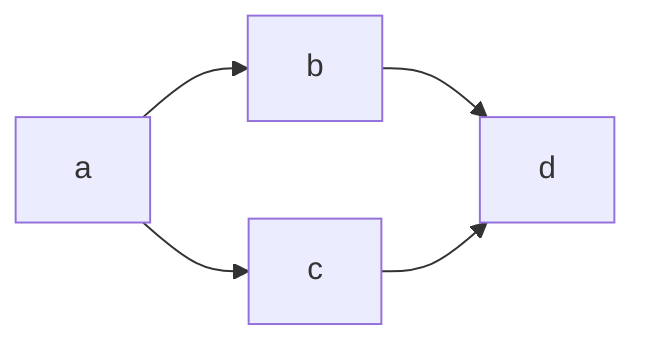

```shell
docker build -t lambda_function:0.1 -f docker/Dockerfile .

docker image ls

docker run -it {{ image name}} bash

docker rm -vf $(docker ps -aq)

docker rmi -f $(docker images -aq)

docker-compose -f docker/docker-compose.yml up
```



```shell
flyway -configFiles=flyway_database.conf info
```
